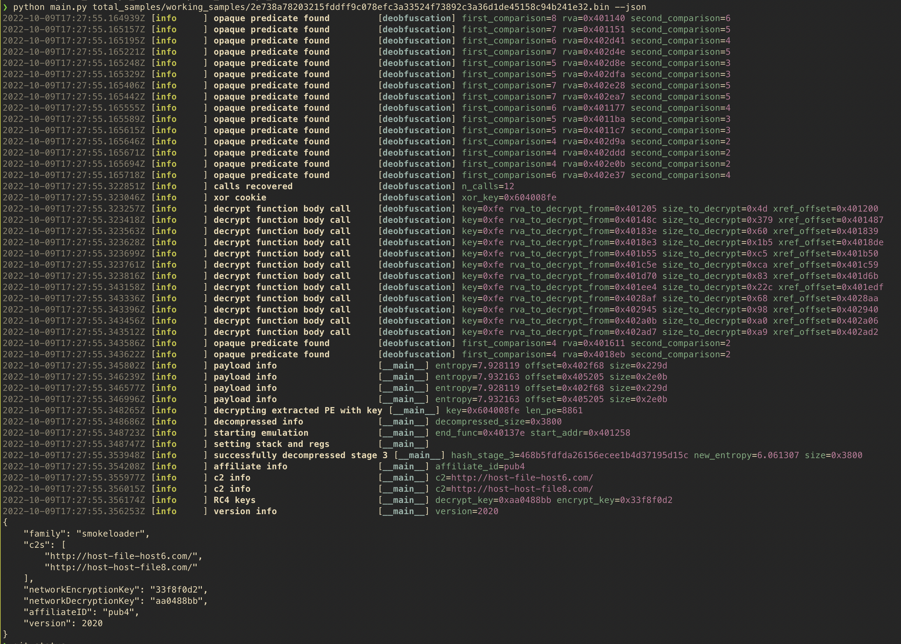

# Smoke Config Extraction

## Preview


## Overview
This project aims to extrct configurations from smokeloader samples starting at the initial stage. I was set on doing this statically so had to rely on things like Unicorn to bypass some of the more complicated components. 

## Features
- deobfuscation
- unpacking of the final stage 
- config extraction

## TO-DO 
- [] LZSA decompression in python
- [] 100% accuracy with affiliate ID extraction

## Projects used 
- [Unicorn Emulator](https://www.unicorn-engine.org) - for emulating the decompression function
- [Radare2](https://rada.re/n/) - provided open source disassembly and function analysis
- Alex Hanel's [Unicorn PE Loader](https://github.com/alexander-hanel/unicorn-engine-notes) - providing the base to load a PE file in Unicorn 

## Example usage 
```
virtualenv venv
source venv/bin/activate
pip install -r requirements.txt 
python main.py smokeloader_stage_1.bin --json
```